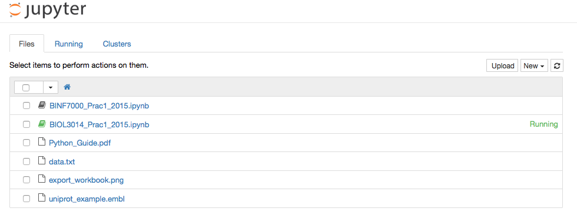

BIOL3014/BINF700 Practical 1: Python Programming
================================================

* Due: 11 AM Wednesday 05/08/2015
* Revision: 1
* Marks: BIOL3014 - 8 marks total. BINF7000 - 12 marks total.

Python programming
------------------

This practical familiarises you with the key elements of the Python 
programming language. Both understanding and writing Python code is 
fundamental for understanding BIOL3014/BINF7000 practicals, projects and 
lectures. We have included the UQ Bioinformatics `Python Guide`_ if you are
new to programming and/or Python.

Instructions
------------

**We expect this practical to be performed on the UQ ILC computers using the 
OSX Yosemite image.**

This practical uses the `IPython Notebook`_. The IPython Notebook is an 
interactive computational environment, in which you can combine code 
execution, rich text, mathematics, plots and rich media. 

You need to install IPython Notebook. Authenticate to the UQ traffic 
management system (if you have not already), then, in the 
*terminal application*, execute the following commands::

    pip install --user "ipython[notebook]"
    export PYTHONPATH=$PYTHONPATH:/Users/local_user/Library/Python/2.7/lib/python/site-packages/
    export PATH=$PATH:/Users/local_user/Library/Python/2.7/bin/
    cd ~/
    mkdir BIOL3014 && cd BIOL3014 && ipython notebook

Your web browser should load up a shiny new IPython Notebook session. **Close it for now.**

Return to the terminal application::

    control-c
    y

This practical also uses the uqseqlib_ Python library, a purpose built set 
of Python modules for UQ Bioinformatics courses. You will need to install 
uqseqlib. In the *terminal application*, execute the following command::

    pip install --user git+https://github.com/UQ-BIOL3014/uqbinfpy.git

Finally, the IPython Notebook for Practical 1 and all associated data can be 
downloaded using the following commands::
    
    cd ~/BIOL3014
    git clone https://github.com/UQ-BIOL3014/Practical1
    cd Practical1/notebook
    ipython notebook

You should see this -

Click on the notebook prefixed with the course identifier that you are enrolled in.

Submission Requirements
-----------------------

Please submit your IPython Notebook with the completed code blocks and 
written answers where requested via the BIOL3014/BINF7000 Blackboard 
submission system. Use the format *STUDENT_NUMBER_P1.ipynb*. Detailed 
instructions are provided at the start of Practical 1.

Late submissions without sufficient reason will incur a 20% loss of the total 
score per late day.

.. _`IPython Notebook`: http://ipython.org/notebook.html
.. _uqseqlib: https://github.com/UQ-BIOL3014/uqbinfpy
.. _`Python Guide`: https://github.com/UQ-BIOL3014/Practical1/blob/master/notebook/Python_Guide.pdf
